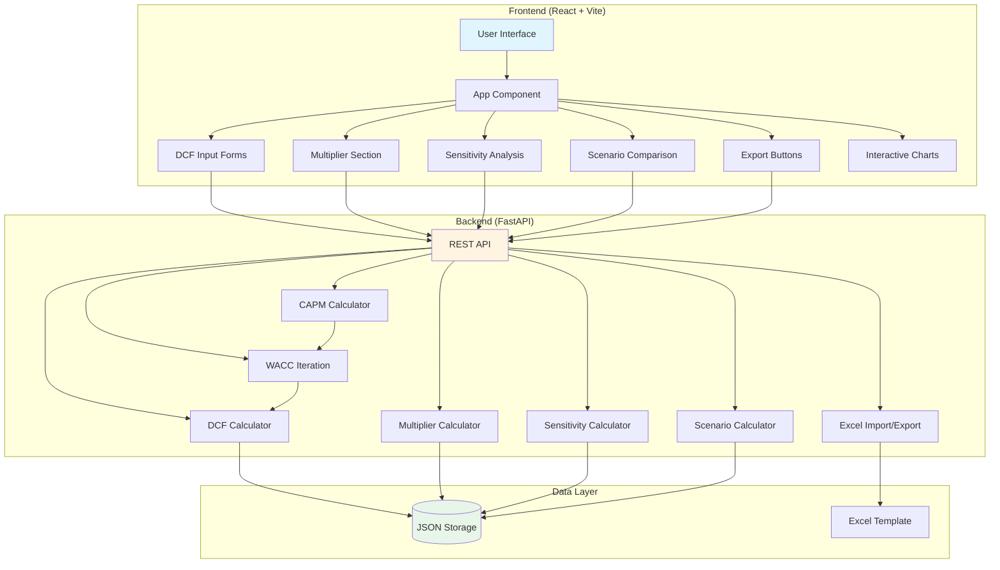
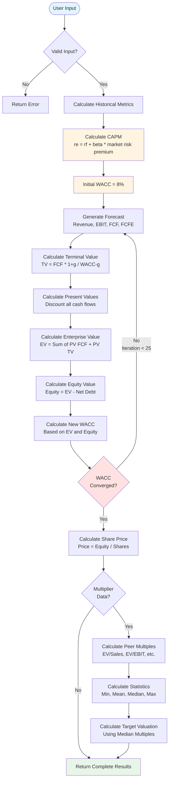

# EquityLens

> Professional web-based DCF valuation with peer group analysis

Modern web application for **Discounted Cash Flow (DCF)** company valuations with integrated **multiplier analysis**. Based on proven Excel models with automatic WACC iteration and comprehensive peer group valuation.

## DISCLAIMER

**This tool is provided for educational purposes only as part of the Financial Analysis course project.**

- This software is provided "as is" without warranty of any kind, express or implied
- No liability is accepted for any financial decisions made based on this tool
- The valuations and analyses are for educational demonstration purposes only
- Always consult qualified financial professionals for investment decisions
- The developers assume no responsibility for any losses or damages arising from the use of this tool

## Key Features

### DCF Valuation
- **WACC Iteration** - Automatic iterative calculation (up to 25 steps)
- **CAPM Model** - Cost of equity based on Capital Asset Pricing Model
- **Dual Approach** - Entity & Equity methods in parallel
- **Tax Shield** - Tax benefits from debt financing
- **Historical Base** - 4 years of historical data

### Multiplier Analysis (Peer Group)
- **5 Multiples** - EV/Sales, EV/EBIT, EV/EBITDA, P/E, P/B
- **Peer Comparison** - Unlimited number of comparable companies
- **Statistics** - Min, Mean, Median, Max + Target comparison
- **Visual Indicators** - Over-/Undervaluation at a glance

### Additional Features
- **Sensitivity Analysis** - WACC ±2%, Terminal Growth ±1%
- **Scenario Comparison** - Best/Base/Worst Case
- **Excel Import/Export** - Import data from Excel
- **Persistence** - Save and load analyses
- **Interactive Charts** - Waterfall, Fair Value, Cash Flow

## Tech Stack

**Backend:** FastAPI (Python) • Pydantic • openpyxl  
**Frontend:** React 18 • Vite • TailwindCSS • Recharts • Framer Motion  
**Data:** JSON-based persistence

## Installation

**Prerequisites:**
- Python 3.8+
- Node.js 16+
- macOS/Linux (for start scripts)

## Quick Start

```bash
# Start (automatically installs all dependencies)
./start.sh

# Stop
./stop.sh
# or Ctrl+C
```

**The start script:**
- Frees ports 8000/3000
- Creates Python venv automatically
- Installs all dependencies
- Starts backend + frontend

**Access:**
- Frontend: http://localhost:3000
- Backend API: http://localhost:8000
- API Docs: http://localhost:8000/docs

## Manual Installation

<details>
<summary>Backend Setup</summary>

```bash
cd backend
python3 -m venv venv
source venv/bin/activate
pip install -r requirements.txt
python main.py
```
</details>

<details>
<summary>Frontend Setup</summary>

```bash
cd frontend
npm install
npm run dev
```
</details>

## Usage

### 1. New DCF Analysis

1. **Base Data** - Company name, shares, debt, current price
2. **Historical Data** (4 years) - Revenue, EBIT, D&A, NWC, CapEx, Interest, Leverage
3. **CAPM Parameters** - Risk-free Rate, Beta, Market Return, Cost of Debt, Tax Rate
4. **Forecast** - Revenue growth, Terminal Growth, Forecast years
5. **Calculate** - Automatic WACC iteration and valuation

### 2. Multiplier Analysis (Optional)

1. **Target Metrics** - Revenue, EBITDA, EBIT, EPS, Book Value, Debt
2. **Peer Companies** - Comparable companies with same metrics
3. **Automatic Calculation** - Statistics and fair value estimates

### 3. Advanced Analyses

- **Sensitivity Analysis** - WACC ±2%, Growth ±1% (9x9 matrix)
- **Scenario Comparison** - Best/Base/Worst case scenarios
- **Excel Import** - Import data from Excel template

### Save & Load

- Analyses are saved automatically
- Click on saved analysis to load
- Delete with trash icon

## API Endpoints

- `GET /api/analyses` - Retrieve all analyses
- `POST /api/analyses` - Create new analysis
- `GET /api/analyses/{id}` - Get specific analysis
- `PUT /api/analyses/{id}` - Update analysis
- `DELETE /api/analyses/{id}` - Delete analysis
- `GET /api/excel-template` - Download Excel template
- `POST /api/excel-import` - Import Excel data
- `POST /api/sensitivity` - Sensitivity analysis
- `POST /api/scenario` - Scenario comparison

**API Documentation:** http://localhost:8000/docs

## Calculation Methodology

<details>
<summary><b>DCF Method</b></summary>

**Historical Analysis** → **CAPM** → **Forecast** → **WACC Iteration** → **Valuation**

1. **CAPM:** `re = rf + β × (rm - rf)`
2. **WACC Iteration:** Up to 25 steps until convergence (Δ < 0.0000001)
3. **Entity Approach:** `EV = Σ PV(FCF) + PV(Terminal Value)`
4. **Equity Approach:** `Equity = Σ PV(FCFE) + PV(TV Equity)`
5. **Fair Value:** `Share Price = Equity Value / Shares`

</details>

<details>
<summary><b>Multiplier Method</b></summary>

**Calculate Peer Multiples** → **Statistics** → **Value Target**

- **Entity:** EV/Sales, EV/EBIT, EV/EBITDA
- **Equity:** P/E, P/B
- **Statistics:** Min, Mean, Median, Max
- **Valuation:** Target × Median Multiple

</details>

## Architecture

### System Architecture



### DCF Calculation Flow



## Project Structure

```
.
├── backend/
│   ├── main.py              # FastAPI Backend
│   ├── requirements.txt     # Dependencies
│   ├── venv/               # Virtual Environment
│   └── data/               # Saved analyses (not in Git)
├── frontend/
│   ├── src/                # React Components
│   ├── package.json        # Dependencies
│   └── vite.config.js      # Build Config
├── start.sh                # Startup Script
├── stop.sh                 # Shutdown Script
└── README.md
```

## Notes

- **Saved analyses** are stored in `backend/data/` (not in Git)
- **Excel template** can be downloaded via `/api/excel-template`
- **API documentation** available at http://localhost:8000/docs
- **Production build:** `cd frontend && npm run build`

## License

MIT License

## Academic Context

**EquityLens** was created as a project for the **Financial Analysis** course. It demonstrates the implementation of DCF valuation models and peer group analysis in a modern web application.

**For educational purposes only - Not for production financial decisions.**
